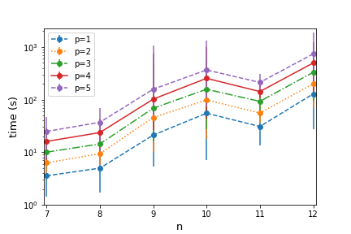
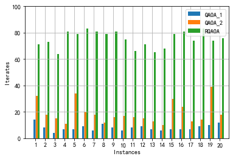

QAOA benchmark
==============

Introduction
------------

1.1 QAOA
~~~~~~~~

In 2014， Farhi et al. proposed the quantum approximate optimization
algorithm (`QAOA <#Farhi14>`__) which is a variational quantum algorithm
aiming at solving combinatorial optimization problems by a parameterized
quantum circuit. Most of the combinatorial optimization problems can be
encoded into some special Hamiltonians (which are diagonal under the Z
basis) such that solving the original problems is equivalent to finding
the ground states of their corresponding Hamitonians.

More specifically, let :math:`H_Z` be the problem Hamitonian of
:math:`n` qubit which is diagonal in the :math:`Z` basis and
:math:`H_X=\sum_{j=1}^n X_j` be the mixer. Fix an integer :math:`p`, the
:math:`p`-th step of QAOA is defined as follows. Set
:math:`\boldsymbol{\beta}=(\beta_1,\beta_2,\cdots,\beta_p)`,
:math:`\boldsymbol{\gamma}=(\gamma_1, \gamma_2,\cdots, \gamma_p)` and
define the ansatz as

.. math::

   |\psi({\boldsymbol{\beta}},{\boldsymbol{\gamma}})\rangle=U(H_X,\beta_p)U(H_Z,\gamma_p)\cdots U(H_X,\beta_1)U(H_Z,\gamma_1)|{+}\rangle^{\otimes n}

where :math:`U(H,\alpha) = e^{-i\alpha H}` and
:math:`|{+}\rangle = \frac{1}{\sqrt{2}}(|{0}\rangle + |{1}\rangle)`.
Define

.. math::

   F_p:=\max_{\boldsymbol{\beta},{\boldsymbol{\gamma}}}    F_p(\boldsymbol{\beta},{\boldsymbol{\gamma}}) =\max_{\boldsymbol{\beta},\boldsymbol{\gamma}} \langle{\psi(\boldsymbol{\beta},\boldsymbol{\gamma})}|H_Z|\psi(\boldsymbol{\beta},\boldsymbol{\gamma})\rangle.

 Then it can be showed that the following equality holds:

.. math:: \lim_{p\rightarrow+\infty} F_p=\max_{|\psi\rangle}\{ \langle \psi| H_Z|\psi\rangle\}.

Given :math:`H_Z`, denote
:math:`W:=\max_{|\psi\rangle}\{ \langle \psi| H_Z|\psi\rangle\}` as the
maximum solution to the optimization problem, which is assumed to be
positive. Then the approximate ratio of :math:`p`-level QAOA on this
problem is defined as :math:`\frac{F_p}{W}`, which is always less than
one.

1.2 Max Cut Problem
~~~~~~~~~~~~~~~~~~~

A canonical example of combinatorial optimization problem is Max Cut.
The problem is defined as follows. Let :math:`G = (V, E)` be a simple
undirected graph. A cut is a function :math:`c : V \rightarrow\{1, -1\}`
that labels the nodes with symbols :math:`1` and :math:`-1`. An edge
:math:`(i, j) \in E` is a cut edge if :math:`c(i) \neq  c(j).` Let
:math:`N(c)` denote the number of the cutting edges. Then the classical
Max Cut problem is to find a function :math:`c` with maximal cutting
edges :math:`N(c)`. That is,

.. math:: \max_{c} N(c)=\max_{c} \sum_{(i, j) \in E} [1-c(i)c(j)]/2.

| More general, we may consider a graph :math:`G = (V, E)` with
weighting edges :math:`\omega: E \rightarrow [-1,1].` Then the
corresponding Max Cut problem is to find a cut :math:`c` maximize the
following term
| 

.. math:: \max_{c} \sum_{(i, j) \in E} w(i,j) [1-c(i)c(j)]/2.

Platform info
-------------

OS: CPU: BLAS: LIBM: GPU:

Below is the information of the packages used.

+------------+-----------+
| Package    | Version   |
+============+===========+
| Python     | 2.7.12    |
+------------+-----------+
| NumPy      | 1.18.3    |
+------------+-----------+
| SciPy      | 1.4.1     |
+------------+-----------+
| projectq   | 0.5.0     |
+------------+-----------+
| ...        | ...       |
+------------+-----------+

Benchmarking the standard QAOA
------------------------------

Here and below, we refer to standard QAOA as the one proposed in `Farhi
et al.'s paper <#Harhi14>`__. In the standard QAOA, the mixer is chosen
to be :math:`H_X = \sum_i X_i`.

3.1 Setting
~~~~~~~~~~~

**Classical optimizer**:
`SLSQP <https://docs.scipy.org/doc/scipy/reference/optimize.minimize-slsqp.html>`__

**Random graphs generation**: `Erdos-Renyi
graphs <https://networkx.org/documentation/stable/reference/generated/networkx.generators.random_graphs.gnp_random_graph.html>`__
with prob = 0.4, seed\_set =
{123,231,245,114,523,567,457,129,325,657,554,234,226,347,128,193,456,753,248,675}

**Strategy for optimization:** Running the QAOA for :math:`p=1` with 50
times and chose an optimal solution. The running time corresponds to
this optimal one. The intial parameters in depth :math:`p+1` QAOA depend
on those of the "optimal ones" in the depth :math:`p` QAOA.
Specifically, :math:`\beta^{(p+1)}_i={\beta *}^{(p)}_i` for
:math:`i=1,\cdots,p` and
:math:`\beta^{(p+1)}_{p+1}={\beta  *}^{(p)}_{p}`.

3.2 Results
~~~~~~~~~~~

.. figure:: images/q1.jpg

 Figure 3.1: time vs. :math:`p` for :math:`n=7—12`

Figure 3.2: time vs. :math:`n` for :math:`p=1,2,3,4,5`\ 

.. figure:: images/q3.jpg

Figure 3.3: approximation ratio vs. :math:`p` for :math:`n=7—12`\ 

.. figure:: images/q4.jpg

Figure 3.4: approximation ratio vs. :math:`n` for
:math:`p = 1,2,3,4,5`\ 

.. figure:: images/q5.jpg

 Figure 3.5: number of iterations vs. :math:`p` for :math:`n=7—12`\ 

.. figure:: images/q6.jpg

Figure 3.6: number of iterations vs. :math:`n` for :math:`p=1,2,3,4,5`\ 

Benchmarking recursive QAOA
---------------------------

Here, we compare the performance of `RQAOA <#Bravyi19>`__ with the
standard QAOA. Roughly speaking, RQAOA is a method to recursively run
QAOA and reduce the problem size by 1 at each recursion. It is argued
that RQAOA outperforms the standard QAOA.

4.1 Setting
~~~~~~~~~~~

**Classical optimizer**:
`L-BFGS-B <https://docs.scipy.org/doc/scipy/reference/optimize.minimize-lbfgsb.html>`__

**Random graphs generation**: We use two methods to generate random
graphs - `random regular
graphs <https://networkx.org/documentation/stable/reference/generated/networkx.generators.random_graphs.random_regular_graph.html>`__

-  `Erdos-Renyi
   graphs <https://networkx.org/documentation/stable/reference/generated/networkx.generators.random_graphs.gnp_random_graph.html>`__
   with prob = 0.65, seed\_set
   ={5,13,48,53,58,70,89,91,100,104,123,140,150,169,182,200,210,220,227,230}

4.2 Results
~~~~~~~~~~~

.. figure:: images/q7.png

Figure 4.1: approximate ratio of RQAOA and QAOA of depth :math:`p=1,2`
of 20 instances on random regular graphs :math:`(n=15,d=6)`.

.. figure:: images/q8.png

Figure 4.2: time consumed for RQAOA and QAOA of depth :math:`p=1,2` of
20 instances on random regular graphs :math:`(n=15,d=6)`.

.. figure:: images/q9.png

Figure 4.3: approximate ratio of RQAOA and QAOA of depth :math:`p=1,2`
of 20 instances on Erdos-Renyi graphs with :math:`n=10` nodes.

Figure 4.4: Iterations of RQAOA and QAOA of depth :math:`p=1,2` of 20
instances on Erdos-Renyi graphs with :math:`n=10` nodes.

.. figure:: images/q11.png

Figure 4.5: approximate ratio of RQAOA and QAOA of depth :math:`p=1,2`
of 20 instances on Erdos-Renyi graphs with :math:`n=6-11` nodes.

.. figure:: images/q12.png

Figure 4.6: Iterations of RQAOA and QAOA of depth :math:`p=1,2` of 20
instances on Erdos-Renyi graphs with :math:`n=6-11` nodes.

References
----------

 [Farhi14] Edward Farhi, Jeffrey Goldstone, Sam Gutmann. A Quantum
Approximate Optimization Algorithm, arXiv:1411.4028.

 [Bravyi19] Sergey Bravyi, Alexander Kliesch, Robert Koenig, and Eugene
Tang, Obstacles to State Preparation and Variational Optimization from
Symmetry Protection, arXiv:1910.08980v1.
